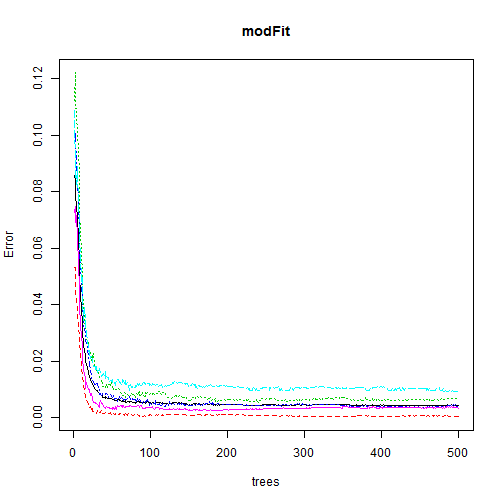

Prediction analysis for weight lifting
========================================================


This project uses data was collected from accelerometers on the belt, forearm, arm, and dumbell to predict the manner in which they performed their fitness exercise. The data consists of a training set and a test set and includes 159 features and one predictor ("classe" variable).

This report describes how I built my model, why I made the choices I did and also uses my prediction model to predict 20 different test cases. 

More information about the dataset is available from: 
http://groupware.les.inf.puc-rio.br/har (see the section on the Weight Lifting Exercise Dataset).


## Useful libraries


```r
library(caret)
```

```
## Warning: package 'caret' was built under R version 3.0.3
```

```
## Loading required package: lattice
```

```
## Warning: package 'lattice' was built under R version 3.0.3
```

```
## Loading required package: ggplot2
```

```
## Warning: package 'ggplot2' was built under R version 3.0.3
```

```r
library(randomForest)
```

```
## randomForest 4.6-7
## Type rfNews() to see new features/changes/bug fixes.
```


## Load the data
### Training set

```r
train <- read.csv("./Data/pml-training.csv")
dim(train)
```

```
## [1] 19622   160
```

### Test set

```r
test <- read.csv("./Data/pml-testing.csv")
dim(test)
```

```
## [1]  20 160
```

## Create a validation set

```r
set.seed(12345)
trainIndex = createDataPartition(train$classe, p = 0.80,list=FALSE)
training = train[trainIndex,]
validation = train[-trainIndex,]
```

## Exploratory data analysis (on the training set)
### Quick look at the training dataset

```r
str(training)
```

```
## 'data.frame':	15699 obs. of  160 variables:
##  $ X                       : int  2 3 4 5 6 7 8 11 12 13 ...
##  $ user_name               : Factor w/ 6 levels "adelmo","carlitos",..: 2 2 2 2 2 2 2 2 2 2 ...
##  $ raw_timestamp_part_1    : int  1323084231 1323084231 1323084232 1323084232 1323084232 1323084232 1323084232 1323084232 1323084232 1323084232 ...
##  $ raw_timestamp_part_2    : int  808298 820366 120339 196328 304277 368296 440390 500302 528316 560359 ...
##  $ cvtd_timestamp          : Factor w/ 20 levels "02/12/2011 13:32",..: 9 9 9 9 9 9 9 9 9 9 ...
##  $ new_window              : Factor w/ 2 levels "no","yes": 1 1 1 1 1 1 1 1 1 1 ...
##  $ num_window              : int  11 11 12 12 12 12 12 12 12 12 ...
##  $ roll_belt               : num  1.41 1.42 1.48 1.48 1.45 1.42 1.42 1.45 1.43 1.42 ...
##  $ pitch_belt              : num  8.07 8.07 8.05 8.07 8.06 8.09 8.13 8.18 8.18 8.2 ...
##  $ yaw_belt                : num  -94.4 -94.4 -94.4 -94.4 -94.4 -94.4 -94.4 -94.4 -94.4 -94.4 ...
##  $ total_accel_belt        : int  3 3 3 3 3 3 3 3 3 3 ...
##  $ kurtosis_roll_belt      : Factor w/ 397 levels "","-0.016850",..: 1 1 1 1 1 1 1 1 1 1 ...
##  $ kurtosis_picth_belt     : Factor w/ 317 levels "","-0.021887",..: 1 1 1 1 1 1 1 1 1 1 ...
##  $ kurtosis_yaw_belt       : Factor w/ 2 levels "","#DIV/0!": 1 1 1 1 1 1 1 1 1 1 ...
##  $ skewness_roll_belt      : Factor w/ 395 levels "","-0.003095",..: 1 1 1 1 1 1 1 1 1 1 ...
##  $ skewness_roll_belt.1    : Factor w/ 338 levels "","-0.005928",..: 1 1 1 1 1 1 1 1 1 1 ...
##  $ skewness_yaw_belt       : Factor w/ 2 levels "","#DIV/0!": 1 1 1 1 1 1 1 1 1 1 ...
##  $ max_roll_belt           : num  NA NA NA NA NA NA NA NA NA NA ...
##  $ max_picth_belt          : int  NA NA NA NA NA NA NA NA NA NA ...
##  $ max_yaw_belt            : Factor w/ 68 levels "","-0.1","-0.2",..: 1 1 1 1 1 1 1 1 1 1 ...
##  $ min_roll_belt           : num  NA NA NA NA NA NA NA NA NA NA ...
##  $ min_pitch_belt          : int  NA NA NA NA NA NA NA NA NA NA ...
##  $ min_yaw_belt            : Factor w/ 68 levels "","-0.1","-0.2",..: 1 1 1 1 1 1 1 1 1 1 ...
##  $ amplitude_roll_belt     : num  NA NA NA NA NA NA NA NA NA NA ...
##  $ amplitude_pitch_belt    : int  NA NA NA NA NA NA NA NA NA NA ...
##  $ amplitude_yaw_belt      : Factor w/ 4 levels "","#DIV/0!","0.00",..: 1 1 1 1 1 1 1 1 1 1 ...
##  $ var_total_accel_belt    : num  NA NA NA NA NA NA NA NA NA NA ...
##  $ avg_roll_belt           : num  NA NA NA NA NA NA NA NA NA NA ...
##  $ stddev_roll_belt        : num  NA NA NA NA NA NA NA NA NA NA ...
##  $ var_roll_belt           : num  NA NA NA NA NA NA NA NA NA NA ...
##  $ avg_pitch_belt          : num  NA NA NA NA NA NA NA NA NA NA ...
##  $ stddev_pitch_belt       : num  NA NA NA NA NA NA NA NA NA NA ...
##  $ var_pitch_belt          : num  NA NA NA NA NA NA NA NA NA NA ...
##  $ avg_yaw_belt            : num  NA NA NA NA NA NA NA NA NA NA ...
##  $ stddev_yaw_belt         : num  NA NA NA NA NA NA NA NA NA NA ...
##  $ var_yaw_belt            : num  NA NA NA NA NA NA NA NA NA NA ...
##  $ gyros_belt_x            : num  0.02 0 0.02 0.02 0.02 0.02 0.02 0.03 0.02 0.02 ...
##  $ gyros_belt_y            : num  0 0 0 0.02 0 0 0 0 0 0 ...
##  $ gyros_belt_z            : num  -0.02 -0.02 -0.03 -0.02 -0.02 -0.02 -0.02 -0.02 -0.02 0 ...
##  $ accel_belt_x            : int  -22 -20 -22 -21 -21 -22 -22 -21 -22 -22 ...
##  $ accel_belt_y            : int  4 5 3 2 4 3 4 2 2 4 ...
##  $ accel_belt_z            : int  22 23 21 24 21 21 21 23 23 21 ...
##  $ magnet_belt_x           : int  -7 -2 -6 -6 0 -4 -2 -5 -2 -3 ...
##  $ magnet_belt_y           : int  608 600 604 600 603 599 603 596 602 606 ...
##  $ magnet_belt_z           : int  -311 -305 -310 -302 -312 -311 -313 -317 -319 -309 ...
##  $ roll_arm                : num  -128 -128 -128 -128 -128 -128 -128 -128 -128 -128 ...
##  $ pitch_arm               : num  22.5 22.5 22.1 22.1 22 21.9 21.8 21.5 21.5 21.4 ...
##  $ yaw_arm                 : num  -161 -161 -161 -161 -161 -161 -161 -161 -161 -161 ...
##  $ total_accel_arm         : int  34 34 34 34 34 34 34 34 34 34 ...
##  $ var_accel_arm           : num  NA NA NA NA NA NA NA NA NA NA ...
##  $ avg_roll_arm            : num  NA NA NA NA NA NA NA NA NA NA ...
##  $ stddev_roll_arm         : num  NA NA NA NA NA NA NA NA NA NA ...
##  $ var_roll_arm            : num  NA NA NA NA NA NA NA NA NA NA ...
##  $ avg_pitch_arm           : num  NA NA NA NA NA NA NA NA NA NA ...
##  $ stddev_pitch_arm        : num  NA NA NA NA NA NA NA NA NA NA ...
##  $ var_pitch_arm           : num  NA NA NA NA NA NA NA NA NA NA ...
##  $ avg_yaw_arm             : num  NA NA NA NA NA NA NA NA NA NA ...
##  $ stddev_yaw_arm          : num  NA NA NA NA NA NA NA NA NA NA ...
##  $ var_yaw_arm             : num  NA NA NA NA NA NA NA NA NA NA ...
##  $ gyros_arm_x             : num  0.02 0.02 0.02 0 0.02 0 0.02 0.02 0.02 0.02 ...
##  $ gyros_arm_y             : num  -0.02 -0.02 -0.03 -0.03 -0.03 -0.03 -0.02 -0.03 -0.03 -0.02 ...
##  $ gyros_arm_z             : num  -0.02 -0.02 0.02 0 0 0 0 0 0 -0.02 ...
##  $ accel_arm_x             : int  -290 -289 -289 -289 -289 -289 -289 -290 -288 -287 ...
##  $ accel_arm_y             : int  110 110 111 111 111 111 111 110 111 111 ...
##  $ accel_arm_z             : int  -125 -126 -123 -123 -122 -125 -124 -123 -123 -124 ...
##  $ magnet_arm_x            : int  -369 -368 -372 -374 -369 -373 -372 -366 -363 -372 ...
##  $ magnet_arm_y            : int  337 344 344 337 342 336 338 339 343 338 ...
##  $ magnet_arm_z            : int  513 513 512 506 513 509 510 509 520 509 ...
##  $ kurtosis_roll_arm       : Factor w/ 330 levels "","-0.02438",..: 1 1 1 1 1 1 1 1 1 1 ...
##  $ kurtosis_picth_arm      : Factor w/ 328 levels "","-0.00484",..: 1 1 1 1 1 1 1 1 1 1 ...
##  $ kurtosis_yaw_arm        : Factor w/ 395 levels "","-0.01548",..: 1 1 1 1 1 1 1 1 1 1 ...
##  $ skewness_roll_arm       : Factor w/ 331 levels "","-0.00051",..: 1 1 1 1 1 1 1 1 1 1 ...
##  $ skewness_pitch_arm      : Factor w/ 328 levels "","-0.00184",..: 1 1 1 1 1 1 1 1 1 1 ...
##  $ skewness_yaw_arm        : Factor w/ 395 levels "","-0.00311",..: 1 1 1 1 1 1 1 1 1 1 ...
##  $ max_roll_arm            : num  NA NA NA NA NA NA NA NA NA NA ...
##  $ max_picth_arm           : num  NA NA NA NA NA NA NA NA NA NA ...
##  $ max_yaw_arm             : int  NA NA NA NA NA NA NA NA NA NA ...
##  $ min_roll_arm            : num  NA NA NA NA NA NA NA NA NA NA ...
##  $ min_pitch_arm           : num  NA NA NA NA NA NA NA NA NA NA ...
##  $ min_yaw_arm             : int  NA NA NA NA NA NA NA NA NA NA ...
##  $ amplitude_roll_arm      : num  NA NA NA NA NA NA NA NA NA NA ...
##  $ amplitude_pitch_arm     : num  NA NA NA NA NA NA NA NA NA NA ...
##  $ amplitude_yaw_arm       : int  NA NA NA NA NA NA NA NA NA NA ...
##  $ roll_dumbbell           : num  13.1 12.9 13.4 13.4 13.4 ...
##  $ pitch_dumbbell          : num  -70.6 -70.3 -70.4 -70.4 -70.8 ...
##  $ yaw_dumbbell            : num  -84.7 -85.1 -84.9 -84.9 -84.5 ...
##  $ kurtosis_roll_dumbbell  : Factor w/ 398 levels "","-0.0035","-0.0073",..: 1 1 1 1 1 1 1 1 1 1 ...
##  $ kurtosis_picth_dumbbell : Factor w/ 401 levels "","-0.0163","-0.0233",..: 1 1 1 1 1 1 1 1 1 1 ...
##  $ kurtosis_yaw_dumbbell   : Factor w/ 2 levels "","#DIV/0!": 1 1 1 1 1 1 1 1 1 1 ...
##  $ skewness_roll_dumbbell  : Factor w/ 401 levels "","-0.0082","-0.0096",..: 1 1 1 1 1 1 1 1 1 1 ...
##  $ skewness_pitch_dumbbell : Factor w/ 402 levels "","-0.0053","-0.0084",..: 1 1 1 1 1 1 1 1 1 1 ...
##  $ skewness_yaw_dumbbell   : Factor w/ 2 levels "","#DIV/0!": 1 1 1 1 1 1 1 1 1 1 ...
##  $ max_roll_dumbbell       : num  NA NA NA NA NA NA NA NA NA NA ...
##  $ max_picth_dumbbell      : num  NA NA NA NA NA NA NA NA NA NA ...
##  $ max_yaw_dumbbell        : Factor w/ 73 levels "","-0.1","-0.2",..: 1 1 1 1 1 1 1 1 1 1 ...
##  $ min_roll_dumbbell       : num  NA NA NA NA NA NA NA NA NA NA ...
##  $ min_pitch_dumbbell      : num  NA NA NA NA NA NA NA NA NA NA ...
##  $ min_yaw_dumbbell        : Factor w/ 73 levels "","-0.1","-0.2",..: 1 1 1 1 1 1 1 1 1 1 ...
##  $ amplitude_roll_dumbbell : num  NA NA NA NA NA NA NA NA NA NA ...
##   [list output truncated]
```

### Find out the number of complete cases in the training dataset

```r
sum(complete.cases(training))
```

```
## [1] 315
```


A quick look at the data reveals a lot of missing values. Additionally, the first 7 features provide irrelevant information (for instance user name, time stamp, etc.) in the context of this analysis. The subsequent steps help trimming data's dimensionality.


```r
# remove unnecessary columns: the first 7 features 
training <- training[, 8:160]

# compute the total number of non-zero entries for each column
sum.non.zero.columns <- sapply(training, function(column){
    sum(!(is.na(column) | column ==""))
})

# isolate columns labels for columns with non-missing values
complete.columns <- names(sum.non.zero.columns[sum.non.zero.columns == length(training$classe)])

# discard columns with missing data from the training set
training <- training[, complete.columns]
dim(training)
```

```
## [1] 15699    53
```


## Apply similar adjustments to the validation and test sets


```r
# validation set
validation <- validation[, 8:160]
validation <- validation[, complete.columns]

# test set
test <- test[, 8:160]
test <- test[, c(complete.columns[-53], names(test[153]))]
```


## Build the predictive model
### Train the data (Random Forest) using the training set

A Random Forest approach seems adequate for this analysis (lots of data, lots of predictors, no linear assumption).


```r
set.seed(56789)
modFit <- randomForest(classe ~ ., data=training)
```

#### Output for a sample tree (tree #1; first 10 entries only)

```r
head(getTree(modFit, k=1), 10)
```

```
##    left daughter right daughter split var split point status prediction
## 1              2              3        32        0.57      1          0
## 2              4              5        21     -270.50      1          0
## 3              6              7         1      127.50      1          0
## 4              8              9        47       -3.50      1          0
## 5             10             11        38      434.50      1          0
## 6             12             13        10      -96.00      1          0
## 7              0              0         0        0.00     -1          5
## 8             14             15        29       62.56      1          0
## 9             16             17        39       75.00      1          0
## 10            18             19        10     -187.50      1          0
```

#### Visualization

```r
plot(modFit)
```

 

### Compute variable importance accross the whole forest (decreasing order)

```r
impGini <- as.data.frame(importance(modFit))
impGini$feature <- row.names(impGini)
impGini[order(impGini$MeanDecreaseGini, decreasing = T), ]
```

```
##                      MeanDecreaseGini              feature
## roll_belt                     1033.73            roll_belt
## yaw_belt                       727.61             yaw_belt
## pitch_forearm                  638.42        pitch_forearm
## magnet_dumbbell_z              588.07    magnet_dumbbell_z
## pitch_belt                     561.71           pitch_belt
## magnet_dumbbell_y              558.66    magnet_dumbbell_y
## roll_forearm                   468.08         roll_forearm
## magnet_dumbbell_x              389.76    magnet_dumbbell_x
## roll_dumbbell                  346.40        roll_dumbbell
## accel_belt_z                   321.23         accel_belt_z
## accel_dumbbell_y               320.89     accel_dumbbell_y
## magnet_belt_z                  320.08        magnet_belt_z
## magnet_belt_y                  311.08        magnet_belt_y
## accel_dumbbell_z               273.78     accel_dumbbell_z
## accel_forearm_x                251.31      accel_forearm_x
## roll_arm                       248.55             roll_arm
## gyros_belt_z                   239.92         gyros_belt_z
## magnet_forearm_z               225.23     magnet_forearm_z
## total_accel_dumbbell           215.89 total_accel_dumbbell
## magnet_belt_x                  201.60        magnet_belt_x
## magnet_arm_x                   201.59         magnet_arm_x
## yaw_dumbbell                   200.89         yaw_dumbbell
## gyros_dumbbell_y               196.72     gyros_dumbbell_y
## yaw_arm                        195.78              yaw_arm
## accel_forearm_z                195.75      accel_forearm_z
## accel_arm_x                    195.43          accel_arm_x
## accel_dumbbell_x               192.07     accel_dumbbell_x
## magnet_forearm_y               179.48     magnet_forearm_y
## magnet_arm_y                   177.10         magnet_arm_y
## magnet_forearm_x               172.45     magnet_forearm_x
## total_accel_belt               168.30     total_accel_belt
## pitch_dumbbell                 147.44       pitch_dumbbell
## pitch_arm                      142.43            pitch_arm
## yaw_forearm                    142.26          yaw_forearm
## magnet_arm_z                   139.45         magnet_arm_z
## accel_arm_y                    119.95          accel_arm_y
## accel_forearm_y                115.16      accel_forearm_y
## gyros_arm_x                    106.77          gyros_arm_x
## gyros_arm_y                    105.43          gyros_arm_y
## gyros_dumbbell_x               101.70     gyros_dumbbell_x
## accel_arm_z                    100.61          accel_arm_z
## gyros_forearm_y                 97.06      gyros_forearm_y
## accel_belt_x                    96.49         accel_belt_x
## accel_belt_y                    94.08         accel_belt_y
## total_accel_forearm             92.03  total_accel_forearm
## gyros_belt_y                    91.23         gyros_belt_y
## total_accel_arm                 80.62      total_accel_arm
## gyros_belt_x                    79.06         gyros_belt_x
## gyros_forearm_z                 66.94      gyros_forearm_z
## gyros_dumbbell_z                66.86     gyros_dumbbell_z
## gyros_forearm_x                 60.55      gyros_forearm_x
## gyros_arm_z                     47.06          gyros_arm_z
```

### How well did the model do on the training set?

```r
modFit
```

```
## 
## Call:
##  randomForest(formula = classe ~ ., data = training) 
##                Type of random forest: classification
##                      Number of trees: 500
## No. of variables tried at each split: 7
## 
##         OOB estimate of  error rate: 0.43%
## Confusion matrix:
##      A    B    C    D    E class.error
## A 4462    2    0    0    0    0.000448
## B   13 3018    7    0    0    0.006583
## C    0   10 2726    2    0    0.004383
## D    0    0   22 2549    2    0.009328
## E    0    0    2    7 2877    0.003119
```


Based on the Random Forest output (above), the overall error rate for the model is low (0.43%). The majority of the 15,699 entries are of class A (i.e. 4462). The confusion matrix for the training set indicates a few missing values. Overall, the Random Forest model fits the training set well.


### How well did the model do on the validation set?

```r
# confusion matrix
confusionMatrix(predict(modFit,newdata=validation[,-53]),validation$classe)
```

```
## Warning: package 'e1071' was built under R version 3.0.3
```

```
## Confusion Matrix and Statistics
## 
##           Reference
## Prediction    A    B    C    D    E
##          A 1116    3    0    0    0
##          B    0  756   10    0    0
##          C    0    0  674    9    0
##          D    0    0    0  634    2
##          E    0    0    0    0  719
## 
## Overall Statistics
##                                         
##                Accuracy : 0.994         
##                  95% CI : (0.991, 0.996)
##     No Information Rate : 0.284         
##     P-Value [Acc > NIR] : <2e-16        
##                                         
##                   Kappa : 0.992         
##  Mcnemar's Test P-Value : NA            
## 
## Statistics by Class:
## 
##                      Class: A Class: B Class: C Class: D Class: E
## Sensitivity             1.000    0.996    0.985    0.986    0.997
## Specificity             0.999    0.997    0.997    0.999    1.000
## Pos Pred Value          0.997    0.987    0.987    0.997    1.000
## Neg Pred Value          1.000    0.999    0.997    0.997    0.999
## Prevalence              0.284    0.193    0.174    0.164    0.184
## Detection Rate          0.284    0.193    0.172    0.162    0.183
## Detection Prevalence    0.285    0.195    0.174    0.162    0.183
## Balanced Accuracy       0.999    0.996    0.991    0.993    0.999
```

```
The first table of this confusion matrix indicates that the Random Forest model missed a few values in the validation set, but was overall pretty accurate with the prediction.

The overall statistics are pretty high, suggesting that the model performs adequately.
```

## Run the predictive model on the test set

```r
predict(modFit, test)
```

```
##  1  2  3  4  5  6  7  8  9 10 11 12 13 14 15 16 17 18 19 20 
##  B  A  B  A  A  E  D  B  A  A  B  C  B  A  E  E  A  B  B  B 
## Levels: A B C D E
```
